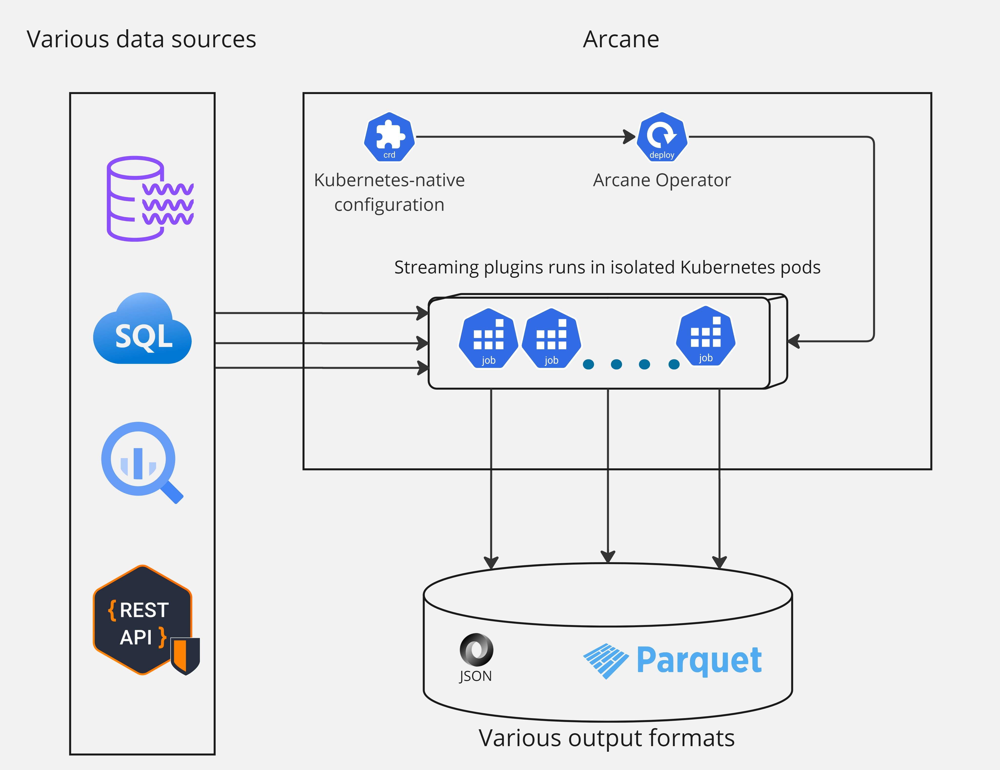

---

_layout: landing

---

# **ARCANE**

{width=450 height=450,  style="float: right;"}

* Arcane is a data streaming platform based on Akka.NET that focuses on providing a simple, reliable,
and scalable solution for data streaming. It is designed to be Kubernetes-native and is built to be cloud-agnostic.

* Unlike other data streaming solutions like Kafka, Arcane is not based on any kind of consensus algorithm.
Instead, it uses a simple and reliable approach to data streaming that is based on the principles of the Actor Model.

* Arcane is implemented as a Kubernetes Operator that manages independent streaming applications isolated in the 
Kubernetes jobs.

Arcane utilizes a plugin architecture that allows extending its functionality with
custom source and sink plugins.

[Concepts](concepts.md) overview.

[Quickstart](quickstart.md) deployment guide.

[Plugins](plugins.md) development guide.

[Operator Architecture](architecture.md) overview.

# Stream plugins

Currently supported stream plugins in production-ready state:
- [REST API](./arcane-rest-api-main/docs/quickstart.html)
