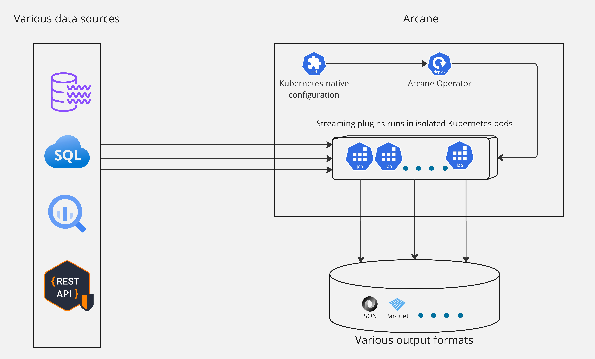

# **ARCANE**

Arcane is a data streaming platform based on [Akka.NET](https://getakka.net/) that focuses on providing a simple,
reliable, and scalable solution for data streaming. It is designed to be Kubernetes-native and is built to be
cloud-agnostic.

- Get your data updates in real-time from various sources to a cloud warehouse or data lake for further processing
  and analysis.
- Use built-in observability features to monitor the streaming jobs and get insights into the data flow.
- Extend the platform with custom source and sink plugins to fit your specific use case.
- Use the built-in backfilling mechanism to ensure that data is not lost in case of data source schema changes.

Unlike other data streaming solutions like Kafka, Arcane is not based on any kind of consensus algorithm. This absence
of consensus-based architectures eliminates their limitations, allowing Arcane to scale both horizontally and vertically.
Additionally, it enables Arcane to benefit from the use of inexpensive spot instances in any cloud.

Arcane is implemented as a [Kubernetes Operator](https://kubernetes.io/docs/concepts/extend-kubernetes/operator/)
that manages independent streaming applications isolated in the Kubernetes jobs.
 
Arcane comes with built-in observability features powered by [Datadog](https://www.datadoghq.com/) platform.

Arcane utilizes a plugin architecture that allows extending its functionality with
custom source and sink plugins.

{width=1076 height=1076,  style="display: block; margin-left: 15%"}

[Concepts](concepts.md) overview.

[Quickstart](quickstart.md) deployment guide.

[Plugins](plugins.md) development guide.

[Operator Architecture](architecture.md) overview.

&nbsp;

## Stream plugins

## Currently supported stream plugins in production-ready state:
- [REST API](rest_api/overview.md)

## Stream plugins coming soon:
- [Microsoft SQL Server](https://github.com/SneaksAndData/arcane-stream-sqlserver-change-tracking/issues/7)
- [Microsoft Dynamics 365 Change Feed](https://github.com/SneaksAndData/arcane-stream-cdm-change-feed/issues/7)
- [Salesforce Bulk API](https://github.com/SneaksAndData/arcane-stream-salesforce/issues/5)

## Public roadmap
Arcane is under active development. Check the [roadmap](https://github.com/orgs/SneaksAndData/projects/21) for the upcoming features.
